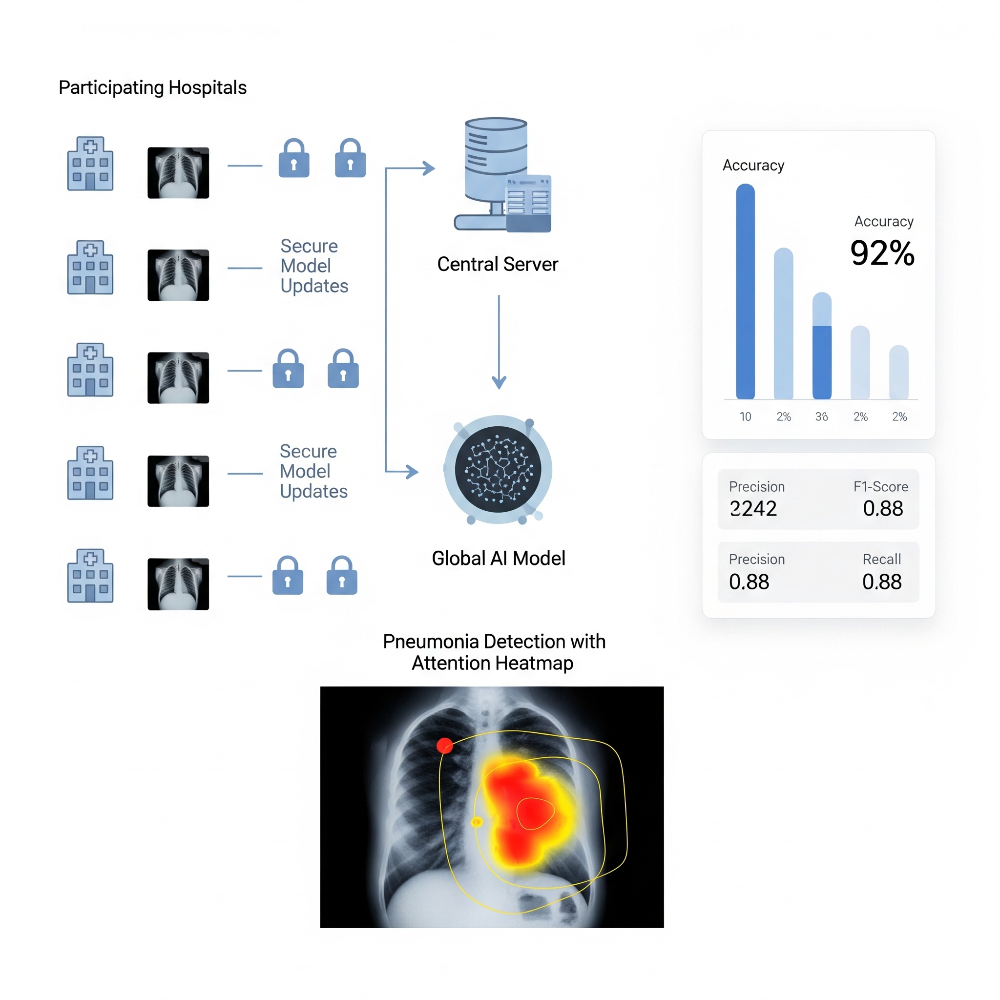

# Professional Frontend Developer Portfolio

## Project Overview

This repository hosts my personal portfolio website, meticulously crafted to showcase my expertise in modern frontend development. Built with **React.js**, this application serves as a dynamic and interactive platform to present my projects, skills, and professional journey. It emphasizes clean code, responsive design, and an intuitive user experience, reflecting my commitment to high-quality web development.

## Features & Highlights

*   **Dynamic Project Showcase:** A dedicated section to display a diverse range of projects, each with detailed descriptions, direct links to GitHub repositories, and live demonstrations (where applicable).
*   **Interactive User Interface:** Leverages React's component-based architecture to create a modular, maintainable, and engaging user experience.
*   **Responsive Design:** Fully optimized for seamless viewing across all devices, from large desktop monitors to tablets and mobile phones, ensuring accessibility and a consistent user experience.
*   **Skill & Experience Overview:** Comprehensive sections detailing my technical proficiencies, educational background, and professional experience.
*   **Integrated Resume:** Provides easy access to my professional resume for download.
*   **Modern Aesthetics:** Incorporates contemporary design principles and smooth animations to create a visually appealing and professional presentation.

## Technologies Utilized

This project is built upon a robust stack of modern frontend technologies:

*   **React.js:** The core library for building the user interface, chosen for its efficiency, component reusability, and strong community support.
*   **React Router DOM:** For declarative routing within the application, enabling smooth navigation between different sections without full page reloads.
*   **React Bootstrap:** A popular frontend framework re-built for React, providing pre-built, responsive UI components that accelerate development and ensure a consistent design.
*   **CSS3:** For custom styling and fine-tuning the visual presentation.
*   **React Icons:** A comprehensive library for incorporating scalable vector icons, enhancing the visual appeal and usability.
*   **React TS Particles:** (Or similar particle library) Used for creating engaging background animations, adding a dynamic and modern touch to the design.

## Live Demonstration

Experience the portfolio live:

[**View Live Demo**](https://pulkitbose-portfolio.netlify.app/)

*Please update the placeholder URL above with your actual deployed link.*

## Visual Showcase

### Home Page


### Projects Section


### Featured Projects

#### Pneumonia Detection Using Federated Learning


#### Skill Barter System


#### Fraud Detection System


#### Farmisian


#### L.A.V.A


## Getting Started

Follow these instructions to set up and run the project locally on your machine.

### Prerequisites

Ensure you have Node.js and npm (Node Package Manager) installed.

*   [Node.js Download](https://nodejs.org/)

### Installation

1.  **Clone the repository:**
    ```bash
    git clone https://github.com/Naman477/Portfolio.git
    cd Portfolio
    ```
    *(Note: If your repository URL is different, please replace `https://github.com/Naman477/Portfolio.git` with your actual GitHub repository link.)*

2.  **Install dependencies:**
    ```bash
    npm install
    ```

### Running the Application

After installation, you can run the development server:

```bash
npm start
```

This command will open the application in your default web browser at `http://localhost:3000`.

## Contact & Portfolio

For inquiries or collaborations, feel free to reach out:

*   **Email:** [naman@gmail.com](mailto:naman@gmail.com)
*   **GitHub Profile:** [https://github.com/Naman477](https://github.com/Naman477)

*(Please replace the GitHub profile link with your actual contact information.)*
